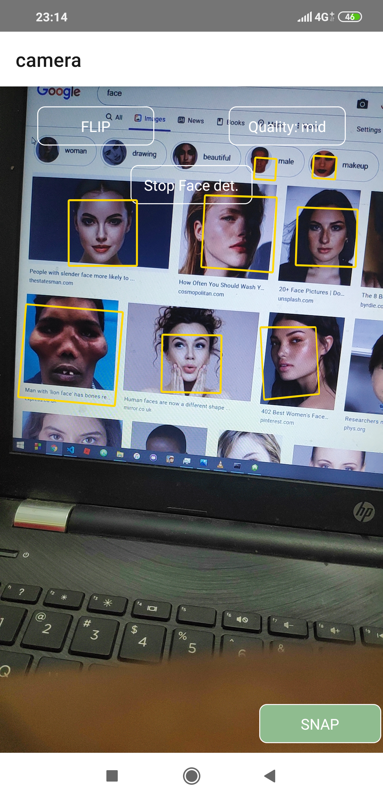

# Face-Camera
A Simple react-native android app that detects faces and takes pics
..
# Installation =>
run npm install or yarn install after cloning...
To Run on device use
 --> react-native run-android
           
# Link For direct download Of APK
   https://drive.google.com/open?id=116tbsrUt1QaMAj8HGRW18M-VIukcPv8m
   
 # App Functions
   The initial camera screen allows you to snap pictures, and has three buttons. (1. Flip, 2.Detect faces, 3.quality of image) 
   The functionality of the buttons are same as the name of the button suggests. 
         
#### ScreenShots - Native App

